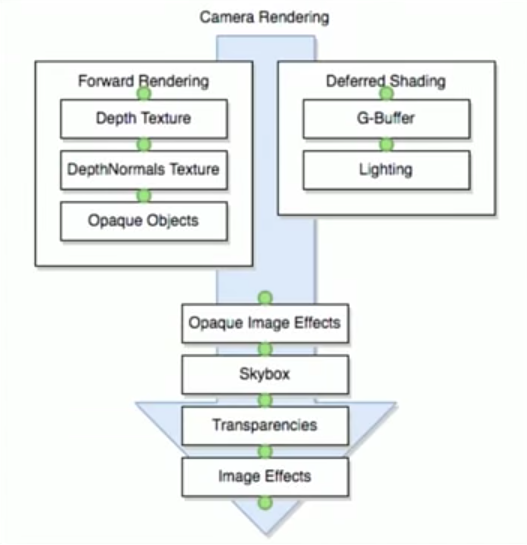

Link: https://www.youtube.com/watch?v=zbjkEQMEShM

SRP is a way to configure rendering from C#

HDSRP and LWSRP

LWSRP -> single pass forward rendering
no point light realtime shadows
no realtime GI
no Light cookies

render pipelines are configured through a scriptable object

scriptable rendering pipelines offer a way to hook into unity´s internal rendering pipeline. not fully costumizable though

Standard shader is comptabile to the built-in RP but not with the new SRP

using the new render pipeline reduces the number of batches significantly

High deginition render pipeline

Shader Model 5 and up

New HD standard shader: https://github.com/Unity-Technologies/ScriptableRenderPipeline/wiki/Lit-Shader

